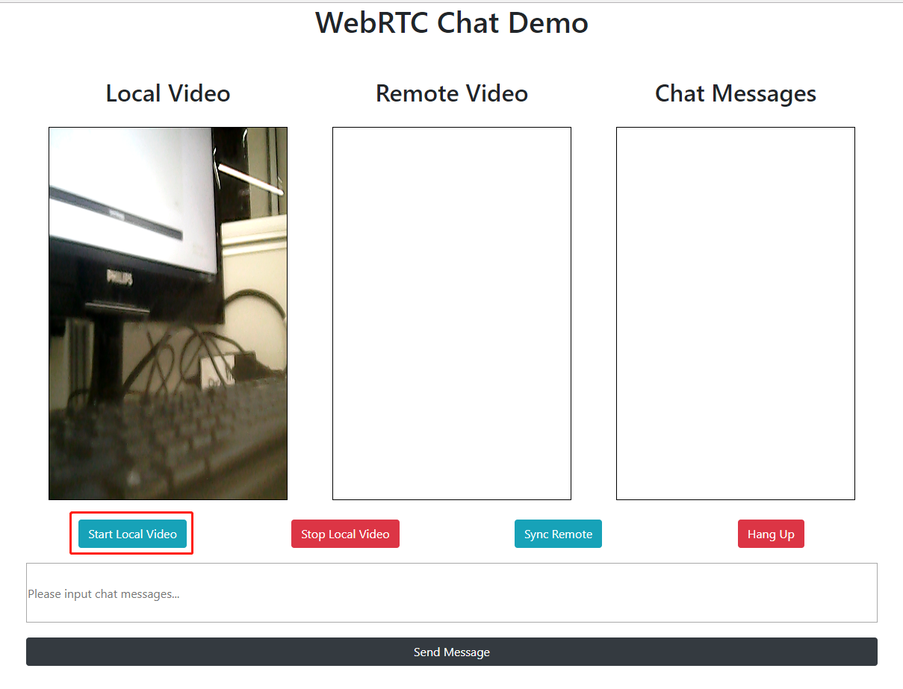
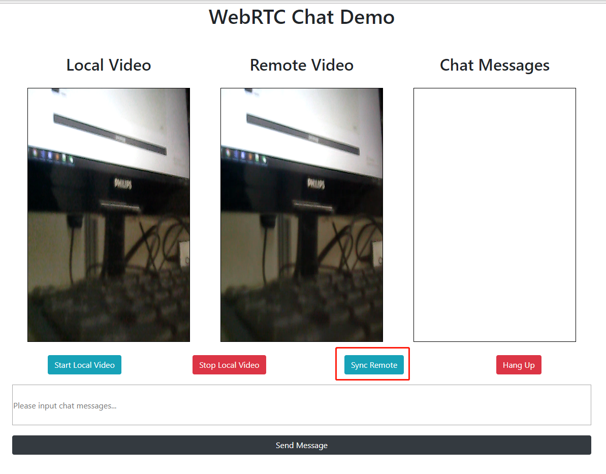
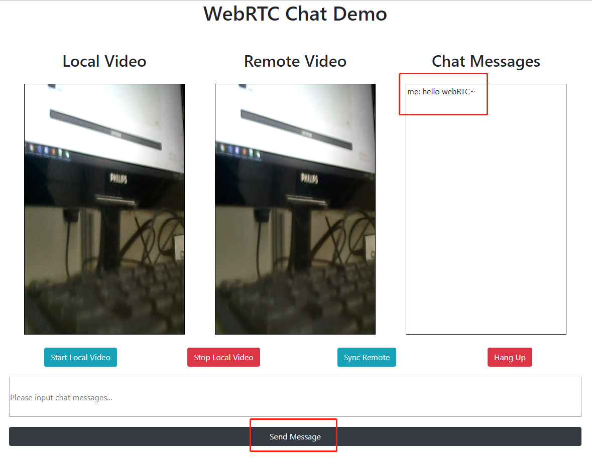

# webRTC-tornado

---

# 简介
- 一个基于tornado和webRTC的点对点视频通信文字聊天例子

---

# 启动
- 准备摄像头
- 执行 python signaling_server.py
- 一个浏览器中打开client.html，点击start video
- 另一个浏览器中打开client.html，点击start video
- 点击connect，同步两边视频

---
# 效果预览

---
# 关于
- 技术博客地址：http://blog.csdn.net/ns2250225
- 邮箱：243027571@qq.com

